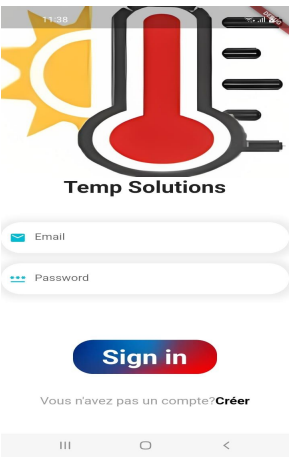
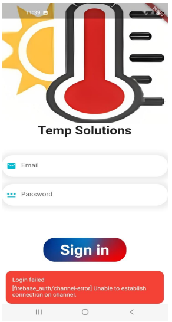
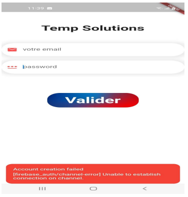
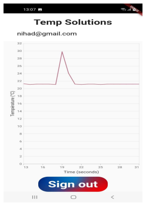
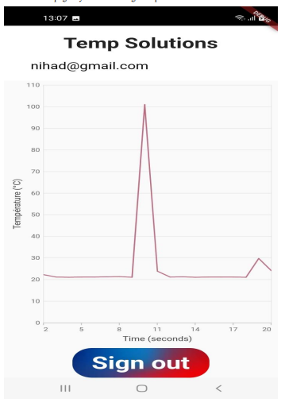
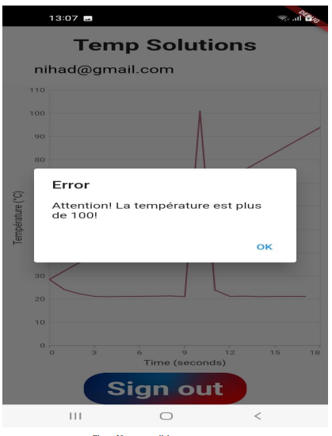

# Description

C'est une application mobile développée avec Flutter et Firebase qui permet de surveiller la température et d'afficher un message d'alerte si celle-ci dépasse 100.

## App
 
 
  
   
    
     
      
       

